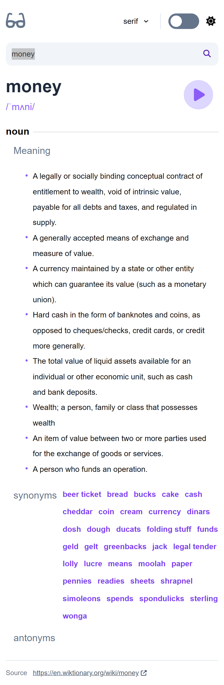

# dictionary-app

This template should help get you started developing with Vue 3 in Vite.

## Target

- [Resource -- frontend mentor](https://www.frontendmentor.io/challenges/dictionary-web-app-h5wwnyuKFL)
- 深色模式  
   
- 明亮模式  
  

## Tools

1. Vue3
2. Vue router
3. Vite
4. ESLint + Prettier
5. TailwindCSS + PostCSS
6. Storybook
7. SCSS
8. axios
9. pinia
10. vitest

## Features

1. storybook 用來測試 switch 元件
2. unit-test 使用 vitest，用來測試 pinia global store
3. web API fetching
4. toggle dark/light mode
5. toggle global font family
6. 使用 tailwind 來設定 styles
7. Web optimization: dynamic import + code split + gzip

## Memo

### 自製元件 - Switches

原本想找網路上現成的，結果會跟 Vue3 衝突，只好自己手寫。

1. 想在自製元件上使用 `v-model` 的話，子元件必須宣告 `modelvalue` 和 `update:modelValue`
2. 詳細看[官方文件](https://vuejs.org/guide/extras/render-function.html#v-model)
3. 大家製作 Switch 的方式通常是用 `button` 包著一個 `input[type="checkbox"]`，按鈕上放置:
   ```javaScript
   @click="$emit('update:modelValue', !modelvalue)"
   ```
4. [範例見 Stackoverflow 上的教學](https://stackoverflow.com/a/72029776)

### 使用 Tailwind

透過 vite 搭建的 Vue 專案中使用 tailwind

1. 安裝方式如下：[官方手冊](https://tailwindcss.com/docs/guides/vite#vue)
2. 只要按照手冊教學通常都會成功

### 在 Storybook 中使用 TailwindCSS

1.  `npx storybook init`
2.  `npm run storybook`
3.  在目前版本中使用 vite + storybook 通常會搭建失敗，顯示錯誤， 解決方式：[看此 issue](https://github.com/storybookjs/builder-vite/issues/554#issuecomment-1422544989)

    ```json
    "overrides": {
        "@storybook/core-common": {
            "glob": "7.2.3",
            "glob-promise": "4.2.0"
        },
        "@storybook/builder-vite": {
            "glob-promise": "4.2.0",
            "glob": "7.2.3"
        }
    },
    ```

4.  在 .storybook/preview.js 中第一行加上
    ```javascript
    import 'tailwindcss/tailwind.css'
    ```
5.  [參考連結](https://www.kantega.no/blogg/setting-up-storybook-7-with-vite-and-tailwind-css)

### 使用 font-awesome

- [參考方式](https://fontawesome.com/docs/web/use-with/vue/)
  ```sh
  npm i --save @fortawesome/fontawesome-svg-core
  npm i --save @fortawesome/free-solid-svg-icons
  npm i --save @fortawesome/vue-fontawesome@latest-3
  ```

### 深色模式

- [參考連結](https://tailwindcss.com/docs/dark-mode)
- [參考連結 2](https://hsuchihting.github.io/TailwindCSS/20210908/2562966958/)
- [參考連結 3](https://codepen.io/adhuham/pen/BaNroxd?editors=0110)
  ```javascript
  if (localStorage.theme === 'dark') {
      document.documentElement.classList.add('dark')
      this.darkMode = true
  }

  dark(newValue) {
      if (newValue) {
          localStorage.theme = 'dark'
          document.documentElement.classList.add('dark')
      } else {
          localStorage.removeItem('theme')
          document.documentElement.classList.remove('dark')
      }
  }
  ```

### 帶有中央線的 H1

[參考解答](https://stackoverflow.com/a/5214204)
此方法不需要 psudo-element

### 使用 `:key` 來強制 re-render 元件

1. `input` 裡的值在從 `/search?q=something` 切換 到 `/` 時要清除，但透過 `<router-link>` 回首頁的話元件不會重渲染，裡面的值也沒清除
2. 解決方式是在元件上加上 `:key="$route.path"`，這樣每次改變網址時 `key` 也會改變，元件會強制重渲染

### `created()` + `watch()` 透過 API 獲取外來資料

1. `created()` 中呼叫 `axios.get()` 這樣第一次搜尋時會發送請求
2. 但之後再搜尋的話，因為此元件已經建立了，所以不會再呼叫 created()，也就不會再發送請求
3. 加上 `watch()`，追蹤網址後方帶的參數是否改變，如果改了就再請求
4. (todo: 也許不需要 `created()`)

### Play Audio

- [solution](https://stackoverflow.com/a/18628124)
  ```javascript
  const audio = new Audio('audio-url')
  audio.play()
  ```

### Change Global Style

- [參考方式](https://stackoverflow.com/a/64317504)
  ```javascript
  document.documentElement.style.setProperty('--font-size', newFontSize)
  ```

### Pending

1. 在呼叫 API 時啟動 pending
   ```javascript
   api.interceptors.request.use((config) => {
     pend.startPending()
     return config
   })
   ```
2. 在接收到請求時關閉 pending

### Code Splitting & gzip & Dynamic Import

#### Code Splitting

1. 打包出來的檔案 (index.js) 有點太大了，通常會把 .js 拆成 index.js 和 vendor.js。前者是你的主程式碼，後者是外部套件，這就是 code splitting
2. 根據[官方文件](https://cn.vitejs.
   dev/guide/build.html#chunking-strategy)，除了只切出 vendor.js，還可以手動切分檔案
3. 如果只想分 vendor.js，可以這樣寫
   ```javascript
   // vite.config.js
   import { splitVendorChunkPlugin } from 'vite'
   export default defineConfig({
     plugins: [splitVendorChunkPlugin()]
   })
   ```
4. 想手動切的話可以按照[這個手冊](https://rollupjs.org/configuration-options/#output-manualchunks)這樣寫
   ```javascript
   // vite.config.js
   export default defineConfig({
     build: {
       rollupOptions: {
         output: {
           manualChunks: {
             // key => 想切出的檔名, value => 想包在裡面的套件 (Array)
             fontawesome: [
               '@fortawesome/fontawesome-svg-core',
               '@fortawesome/free-solid-svg-icons',
               '@fortawesome/vue-fontawesome'
             ],
             vue: ['vue'],
             'vue-router': ['vue-router']
           }
         }
       }
     }
   })
   ```

#### gzip

1. 檔案切割完了，但有些檔案還是很大 (例如 font-awesome.js)，這時可以使用 gzip 把檔案壓縮 (可以縮小約 1/3 的大小)。如果要在 vite 使用 gzip 先安裝下面的套件
   ```sh
   npm add -D vite-plugin-compression
   ```
2. 在 vite.config.js 設定 gzip，設定完輸入 `npm run build` 就會自動壓縮了
   ```javascript
   import viteCompression from 'vite-plugin-compression'
   export default defineConfig({
     plugins: [
       // ...
       viteCompression({
         // 限制: 512 KB 以上的檔案才要壓縮
         threshold: 512000
       })
     ]
   })
   ```
3. [gzip 參考教學](https://blog.csdn.net/Old_Soldier/article/details/127192862)

#### Dynamic Import

1. 在引用元件時採用動態引入，系統打包時就會自動把元件拆分成獨立的 chunk
2. 在 route 層級時動態引入：
   ```javascript
   {
       path: '/search',
       component: () => import('../views/SearchView.vue'),
   }
   ```
3. 在 local component 內部動態引入：

   ```javascript
   import { defineAsyncComponent } from 'vue'

   export default {
     components: { Switches: defineAsyncComponent(() => import('./Switches.vue')) }
   }
   ```
4. [參考資料](https://stackoverflow.com/a/68568767)

### Sourcemap
- 為了在 devtool 裡方便尋找程式碼的原出處，我們會新增 sourcemap 在打包的 js 當中
    ```javascript
    // vite.config.js
    export default defineConfig({
        build: {
            // inline: 表示把 sourcemap 加在打包的 js 檔最末尾
            sourcemap: 'inline'
        }
    })
    ```

---

## Recommended IDE Setup

[VSCode](https://code.visualstudio.com/) + [Volar](https://marketplace.visualstudio.com/items?itemName=Vue.volar) (and disable Vetur) + [TypeScript Vue Plugin (Volar)](https://marketplace.visualstudio.com/items?itemName=Vue.vscode-typescript-vue-plugin).

## Project Setup

```sh
npm install
```

### Compile and Hot-Reload for Development

```sh
npm run dev
```

### Compile and Minify for Production

```sh
npm run build
```

### Run Unit Tests with [Vitest](https://vitest.dev/)

```sh
npm run test:unit
```

### Lint with [ESLint](https://eslint.org/)

```sh
npm run lint
```
